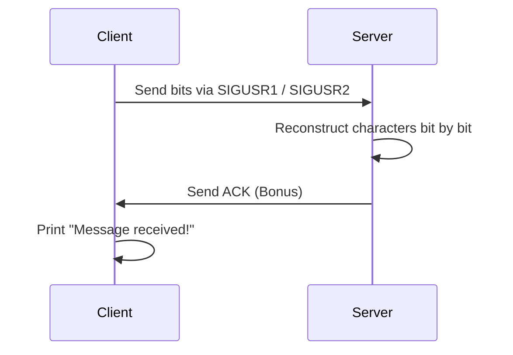

# Minitalk 📨

[](https://github.com/khaledhajeid)
[](https://github.com/khaledhajeid)
[](https://github.com/khaledhajeid)

---

## Overview
`Minitalk` is a **lightweight client-server messaging system** built entirely using **Unix signals (`SIGUSR1` / `SIGUSR2`)** and leveraging my **Libft library** for utility functions.  
It implements a **custom communication protocol** that sends data **bit by bit** between two separate processes, without using sockets or external libraries.  

This project marked my **first experience with inter-process communication (IPC)** and **signal handling**, providing a solid foundation for **low-level system programming**.  
The standard version sends ASCII characters bit by bit, while the bonus version adds **full Unicode support** and **server-to-client acknowledgement** for message delivery.

---

## How It Works

| Component | Standard Version | Bonus Version |
|-----------|-----------------|---------------|
| Data Transfer | Each character sent **bit by bit** using signals | ✅ Same |
| Unicode Support | ❌ ASCII only | ✅ Full Unicode handling |
| Message Delivery Confirmation | ❌ No confirmation | ✅ Server sends **ack** back to client |
| Client Feedback | ❌ Silent after sending | ✅ Prints `"Message received!"` after ACK |

**Key Mechanics**
- **Bit-Level Transmission:** Characters are converted into **8 bits**; each bit is sent as `SIGUSR1` (0) or `SIGUSR2` (1).  
- **Signal Handler Assembly:** Server reconstructs characters **bit by bit** using bitwise operations.  
- **Unicode Safety (Bonus):** Handles **multi-byte UTF-8 sequences** properly.  
- **Acknowledgement Protocol (Bonus):** Server confirms full message receipt by sending a signal back; client prints `"✅ Message received!"`.  

---

## Features
- ✅ Real-time messaging using **Unix signals only**  
- ✅ **Bit-level encoding & decoding**  
- ✅ **Unicode support** (Bonus)  
- ✅ **Server-to-client confirmation** (Bonus)  
- ✅ Clean, modular implementation in **C**
- ✅ Uses **Libft** for reusable utility functions  
---

## Sequence Diagram


## Usage

1. Clone the repository:
```bash
git clone https://github.com/khaledhajeid/minitalk.git
cd minitalk

```
2. Build the project using the Makefile:
```bash
make

And for build the bonus files use:
make bonus
```
This will generate server and client executables.

3. Start the server:
```bash
./server
```
4. In a separate terminal, start the client and send a message:
```bash
./client <server_pid> "Your message here"
```
5. Clean up object files and executables:
```bash
make fclean
```

---

## File Structure
```text
minitalk/
├── client.c
├── server.c
├── client_bonus.c
├── server_bonus.c
├── minitalk.h
├── Makefile
├── libft/          # Custom library used for utility functions
└── README.md
```

---

## Project Highlights
- Built a mini communication protocol from scratch without sockets.
- Applied bitwise operations and signal-based IPC.
- Learned synchronous signaling and acknowledgement systems between processes.
- Bonus mode simulates a reliable messaging layer similar to TCP ACKs.
- Integration with Libft allowed for cleaner, reusable code.
